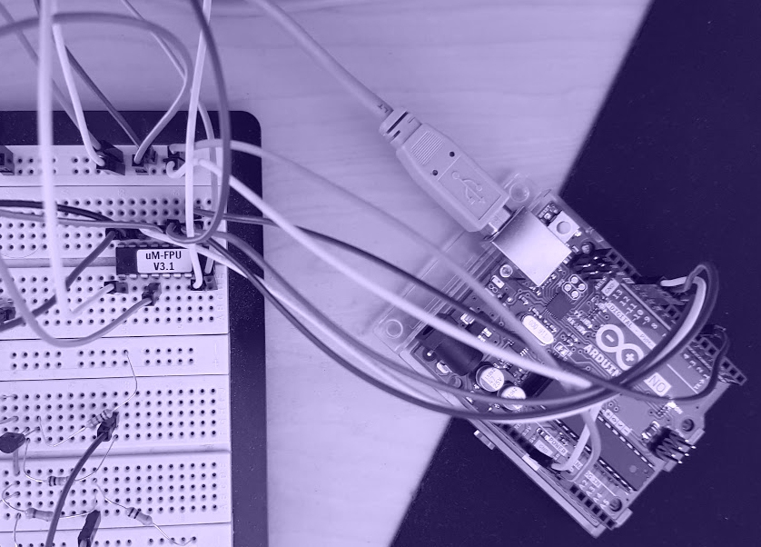

ummmfpu
================
[Teaser Dragon CTF 2019](https://ctftime.org/event/851) (medium, RE).

> So I found this Micromega FPU in my drawer, connected it to an Arduino Uno and programmed it to validate the flag.
>
>  * [ummmfpu.ino](ummmfpu.ino)
>  * [generated.h](generated.h)
>  * [screenshot.png](screenshot.png)

